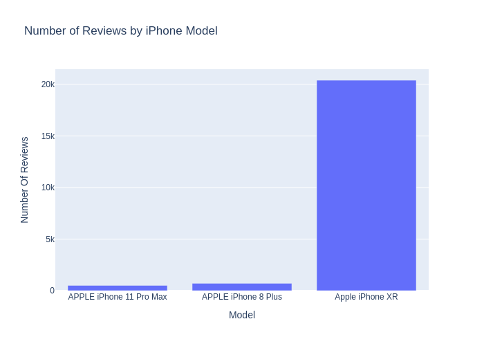
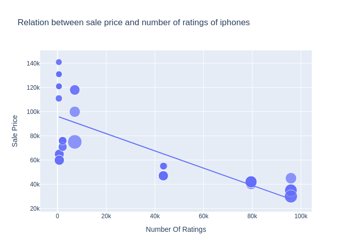
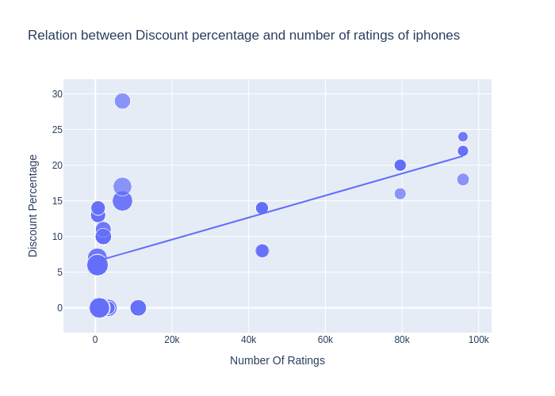

## Key Findings from the Graphs

### 1. First Graph: Model-wise Rating Comparison
In the first graph, we combined different variants of the same iPhone models to get a clear comparison of which model is the best selling in terms of ratings.  
**Finding:** The Apple iPhone XR emerges as one of the highest rated phones among all models.

### 2. Second Graph: Sales vs Sale Price
The second graph explores the relationship between sales and the sale price of iPhones.  
**Finding:** We observed that the sales of a model increase when the price of the mobile is decreased, indicating price sensitivity in the market.

### 3. Third Graph: Sales vs Discount Percentage
The third graph depicts how discounts affect sales.  
**Finding:** Increasing the discount percentage leads to an increase in the sales of the device in the market, highlighting the impact of promotions and offers.

## Graphical Analysis

